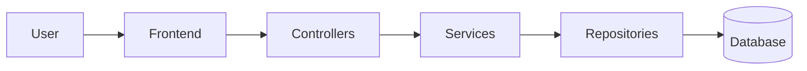

# The Financial Tracker Project

## Introduction
This document outlines the architectural design of the Financial Tracker application. The project requirements specify a relational database with two tables, a Spring Boot backend, and a server-side rendered frontend. The application is designed to demonstrate full database CRUD operations without reliance on external APIs.

### Core Features
- **Transaction Management:** Add, View, Edit, Delete, and Find transactions.
- **Analytics:** Sort categories by expense volume.

### Architectural Flow
User -> Frontend -> Controllers -> Services -> Repositories -> Database



## Database Design

This section provides a comprehensive overview of the relational database design. The project utilizes the H2 database engine for data storage.

### Core Entities

The database consists of two tables representing the core entities within the application logic:
1.  **Categories**
2.  **Transactions**

The relationship between entities is defined in JPA as unidirectional from Categories to Transactions.

#### Relations
The relationship schema is as follows:
`Categories --(1:M)--> Transactions`

#### Database Schema
The following list details the SQL attributes for each table using the format: `[Column Name]: [Type] ([Attributes])`.

- **Categories:**
    1.  `id`: bigint (auto increment; unique)
    2.  `type`: varchar(12) (not null)
    3.  `name`: varchar(50) (not null, unique)

- **Transactions:**
    1.  `id`: bigint (auto increment; unique)
    2.  `category_id`: bigint (not null; foreign key references Categories(id), on delete restrict, create index)
    3.  `description`: varchar(100) (default null)
    4.  `amount`: decimal(10,2) (not null; check (amount >= 0))
    5.  `time`: timestamp (default current_timestamp, not null)

The `amount` column utilizes the `decimal` type to ensure precision and avoid rounding errors common with floating-point types.

#### Table Mapping to Classes
The following outlines the Object-Relational Mapping (ORM) of tables to Java classes using JPA.

**Class: Category**
```java
@Entity
@Table(name = "categories")
public class Category {

    @Id
    @GeneratedValue(strategy = GenerationType.IDENTITY)
    private Long id;

    @Enumerated(EnumType.STRING)
    @Column(name = "type", nullable = false, length = 12)
    private CategoryType type; // Enum: INCOME, EXPENSE

    @Column(name = "name", nullable = false, unique = true, length = 50)
    private String name;
}
```

**Class: Transaction**
```java
@Entity
@Table(name = "transactions")
public class Transaction {

    @Id
    @GeneratedValue(strategy = GenerationType.IDENTITY)
    private Long id;

    @ManyToOne(fetch = FetchType.LAZY)
    @JoinColumn(name = "category_id", nullable = false)
    private Category category;

    @Column(name = "description", length = 100)
    private String description;

    @Column(name = "amount", precision = 10, scale = 2)
    private BigDecimal amount;

    @Column(name = "time", nullable = false)
    private Instant time;
}
```

#### Repositories

Spring Boot repositories facilitate data access following the DAO pattern:

- **CategoryRepository:**
    - Standard `JpaRepository` CRUD methods.
    - Custom methods:
        - `Optional<Category> findByName(String name)`
        - `List<Category> findByType(CategoryType type)`

- **TransactionRepository:**
    - Standard `JpaRepository` CRUD methods.
    - Custom methods:
        - `List<Transaction> findByCategory(Category category)`
        - `List<Transaction> findByCategoryId(Long categoryId)`
        - `Boolean existsByCategoryId(Long categoryId)`
        - `List<Transaction> findAllByOrderByTimeDesc()`

#### Database Initialization
The project includes SQL files for initialization:
- `src/main/resources/data.sql`: Automatically populates the database with sample data upon application startup. This file contains `INSERT` statements only, as the schema is generated automatically by JPA.

## Service Design

This section describes the service layer, which encapsulates the core business logic of the application.

### Data Transfer Objects (DTOs)

DTOs serve as intermediate objects between JPA entities and the frontend/API consumers.

**CategoryDTO:** Represents a category.
```
class CategoryDTO:
    - Long id
    - String name
    - CategoryType type
```

**CategoryRequestDTO:** Handles creation and updates for categories.
```
class CategoryRequestDTO:
    - String name
    - CategoryType type
```

**CategoryExpenseSummaryDTO:** Represents aggregated analytical data.
```
class CategoryExpenseSummaryDTO:
    - Long categoryId
    - String categoryName
    - BigDecimal totalExpenses
```

**TransactionDTO:** Represents a transaction, including flattened category details.
```
class TransactionDTO:
    - Long id
    - String description
    - BigDecimal amount
    - Instant time
    - Long categoryId
    - String categoryName
    - CategoryType categoryType
```

**TransactionRequestDTO:** Handles creation and updates for transactions.
```
class TransactionRequestDTO:
    - String description
    - BigDecimal amount
    - Long categoryId
    - Instant time
```

**ErrorResponseDTO:** Standardizes error responses from the exception handler.
```
class ErrorResponseDTO:
    - Instant timestamp
    - int status
    - String error
    - String message
    - String path
```

### Mapping Entities to DTOs

The project uses `MapStruct` to automate mapping between entities and DTOs.

**CategoryMapper**
```java
@Mapper(componentModel = "spring")
public interface CategoryMapper {
    CategoryDTO toDto(Category category);
    List<CategoryDTO> toDtoList(List<Category> categories);
    Category toEntity(CategoryRequestDTO requestDto);
}
```

**TransactionMapper**
The transaction mapper implements logic to map nested category information.
```java
@Mapper(componentModel = "spring", uses = {CategoryMapper.class})
public interface TransactionMapper {
    @Mapping(source = "category.id", target = "categoryId")
    @Mapping(source = "category.name", target = "categoryName")
    @Mapping(source = "category.type", target = "categoryType")
    TransactionDTO toDto(Transaction transaction);

    List<TransactionDTO> toDtoList(List<Transaction> transactions);

    // The category field is ignored here as it is resolved manually in the service layer
    @Mapping(target = "category", ignore = true)
    Transaction toEntity(TransactionRequestDTO requestDto);
}
```

### Service Interfaces

Interfaces are used to decouple the implementation logic.

```java
public interface CategoryService {
    CategoryDTO createCategory(CategoryRequestDTO request);
    List<CategoryDTO> getAllCategories();
    CategoryDTO getCategoryById(Long id);
    CategoryDTO updateCategory(Long id, CategoryRequestDTO request);
    void deleteCategory(Long id);
}
```

```java
public interface TransactionService {
    TransactionDTO createTransaction(TransactionRequestDTO request);
    List<TransactionDTO> getAllTransactions();
    TransactionDTO getTransactionById(Long id);
    TransactionDTO updateTransaction(Long id, TransactionRequestDTO request);
    void deleteTransaction(Long id);

    // Business Logic Method
    List<CategoryExpenseSummaryDTO> getCategoryExpenseSummary();
}
```

### Service Implementation Logic

The following section outlines the implementation logic for the service classes.

#### CategoryServiceImpl
Annotation: `@Service`, `@Transactional`

1.  **`createCategory(CategoryRequestDTO request)`**
    -   Validate name uniqueness via `CategoryRepository.findByName()`.
    -   Map DTO to Entity.
    -   Save to DB.
    -   Return mapped DTO.
    -   *Exception:* `DuplicateResourceException` if name exists.

2.  **`getAllCategories()`**
    -   Fetch all entities.
    -   Return list of mapped DTOs.

3.  **`getCategoryById(Long id)`**
    -   Find by ID.
    -   *Exception:* `ResourceNotFoundException` if invalid ID.
    -   Return mapped DTO.

4.  **`updateCategory(Long id, CategoryRequestDTO request)`**
    -   Retrieve existing entity.
    -   Validate name uniqueness (if name changed).
    -   Update fields.
    -   Save and return DTO.
    -   *Exceptions:* `ResourceNotFoundException`, `DuplicateResourceException`.

5.  **`deleteCategory(Long id)`**
    -   Validate existence.
    -   Verify no associated transactions exist via `TransactionRepository.existsByCategoryId()`.
    -   Delete entity.
    -   *Exceptions:* `ResourceNotFoundException`, `BusinessLogicException` (if foreign key constraint would be violated).

#### TransactionServiceImpl
Annotation: `@Service`, `@Transactional`

1.  **`createTransaction(TransactionRequestDTO request)`**
    -   Validate existence of `categoryId`.
    -   Map DTO to Entity; manually set the Category entity.
    -   Default `time` to `Instant.now()` if null.
    -   Save and return DTO.
    -   *Exception:* `ResourceNotFoundException` (for invalid Category).

2.  **`getAllTransactions()`**
    -   Fetch all via repository.
    -   Return DTOs sorted by time (recent first).

3.  **`getTransactionById(Long id)`**
    -   Find by ID.
    -   *Exception:* `ResourceNotFoundException`.

4.  **`updateTransaction(Long id, TransactionRequestDTO request)`**
    -   Retrieve existing transaction.
    -   Update fields.
    -   If `categoryId` changed, fetch and set the new Category entity.
    -   Save and return DTO.
    -   *Exception:* `ResourceNotFoundException`.

5.  **`deleteTransaction(Long id)`**
    -   Validate existence.
    -   Delete by ID.

6.  **`getCategoryExpenseSummary()`**
    -   Fetch categories with type `EXPENSE`.
    -   For each category, fetch associated transactions.
    -   Calculate sum of amounts.
    -   Map to `CategoryExpenseSummaryDTO`.
    -   Return list sorted by total expense (descending).

### Exception Handling

Custom exceptions are utilized to enhance error reporting:

1.  **`ResourceNotFoundException` (HTTP 404):** Entity does not exist.
2.  **`DuplicateResourceException` (HTTP 409):** Unique constraint violation (e.g., duplicate category name).
3.  **`BusinessLogicException` (HTTP 400):** Violation of business rules (e.g., deleting a category that has transactions).

These are handled globally via `@RestControllerAdvice`.

## Controllers (API Endpoints)

The controllers manage interaction with external clients and define the API contract.

### API Endpoint Design

#### Category Endpoints
-   `GET /api/categories`: Retrieve all categories.
-   `GET /api/categories/{id}`: Retrieve specific category.
-   `POST /api/categories`: Create a category.
-   `PUT /api/categories/{id}`: Update a category.
-   `DELETE /api/categories/{id}`: Delete a category (returns HTTP 204).

#### Transaction Endpoints
-   `GET /api/transactions`: Retrieve all transactions.
-   `GET /api/transactions/{id}`: Retrieve specific transaction.
-   `POST /api/transactions`: Create a transaction.
-   `PUT /api/transactions/{id}`: Update a transaction.
-   `DELETE /api/transactions/{id}`: Delete a transaction (returns HTTP 204).
-   `GET /api/transactions/category/{categoryId}`: Retrieve transactions filtered by category.

#### Business Logic Endpoints
-   `GET /api/categories/expenses/summary`: Returns `CategoryExpenseSummaryDTO` list for analytics.

### Error Handling
The controllers return consistent HTTP status codes and error messages via the global exception handler:
-   **404**: Resource Not Found.
-   **409**: Duplicate Resource.
-   **400**: Business Logic or Validation Error.
-   **500**: Generic Server Error.

## Frontend Layer

The frontend utilizes server-side rendering with Thymeleaf templates.

### Data Binding
Controllers use `@InitBinder` to manage conversation between HTML form inputs and Java types (e.g., String to Date).

### View Routes and Handlers

#### Main Dashboard
-   **`GET /`**: Displays the dashboard.
    -   *Model:* All transactions, expense summary, category dropdown list, empty `TransactionRequestDTO`.
    -   *Template:* `index.html`

#### Transaction Management
-   **`POST /transactions/add`**: Processes creation form. Redirects to root on success.
-   **`GET /transactions/edit/{id}`**: Displays edit form.
    -   *Template:* `edit-transaction.html`
-   **`POST /transactions/update/{id}`**: Processes update form. Redirects to root on success.
-   **`GET /transactions/delete/{id}`**: Deletes transaction. Redirects to root on success.

#### Category Management
-   **`GET /categories`**: Displays management page.
    -   *Model:* Existing categories, empty `CategoryRequestDTO`.
    -   *Template:* `categories.html`
-   **`POST /categories/add`**: Processes creation form.
-   **`GET /categories/edit/{id}`**: Displays edit form.
    -   *Template:* `edit-category.html`
-   **`POST /categories/update/{id}`**: Processes update form.
-   **`GET /categories/delete/{id}`**: Deletes category. Catches `BusinessLogicException` if transactions exist and displays an error flash message.

### Flash Attributes
`RedirectAttributes` are used to pass temporary messages across redirects:
-   `successMessage`: Rendered as a green alert.
-   `errorMessage`: Rendered as a red alert.

### Form Binding Pattern
The controllers implement the Post-Redirect-Get (PRG) pattern to prevent duplicate form submissions:
1.  **GET:** Display form with empty/populated DTO.
2.  **POST:** Receive bound data via `@ModelAttribute`.
3.  **Process:** Service layer execution.
4.  **Redirect:** Return redirect URL with flash attributes for the next request.

### Templates
-   `index.html`: Main dashboard.
-   `edit-transaction.html`: Transaction modification form.
-   `categories.html`: Category list and creation form.
-   `edit-category.html`: Category modification form.
